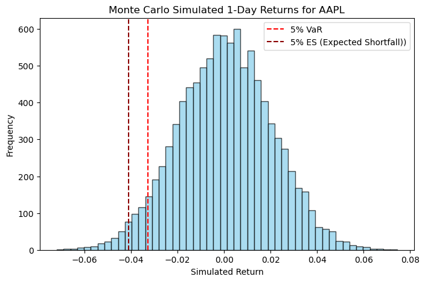

# Project: 1-day Var & ES for single asset

## 1. Problem

Measure the potential 1-day loss for a single stock (e.g., AAPL) under worst-case 5% scenarios.

## 2. Data

- Asset: AAPL (Apple Inc.)
- Time span: last 1 year of daily prices
- Source: Yahoo Finance via Python package `yfinance`

## 3. Model Assumptions

- Use log returns: $r*t = \ln(S_t / S*{t-1})$
- Assume daily returns are normally distributed
- Tomorrow's return follows the same μ and σ as estimated from historical data

## 4. Method

1. Fetch historical daily prices using `yfinance`
2. Compute log returns: $r*t = \ln(S_t / S*{t-1})$
3. Estimate mean (μ) and standard deviation (σ) from historical returns
4. Simulate 10,000 possible tomorrow returns using Monte Carlo
5. Calculate 5% VaR (percentile) and Expected Shortfall (average of worst 5% losses)

## 5. Results

- 1-day 5% VaR: approximately -0.0327 (based on simulation)
- 1-day 5% Expected Shortfall (ES): approximately -0.0411

### Visualization

## 6. Notes and Limitations

- Normality assumption may not hold in real markets
- Single asset, 1-day horizon; does not account for portfolio effects
- Results depend on historical data; extreme events may be underestimated
- This is a minimal project for learning purposes
